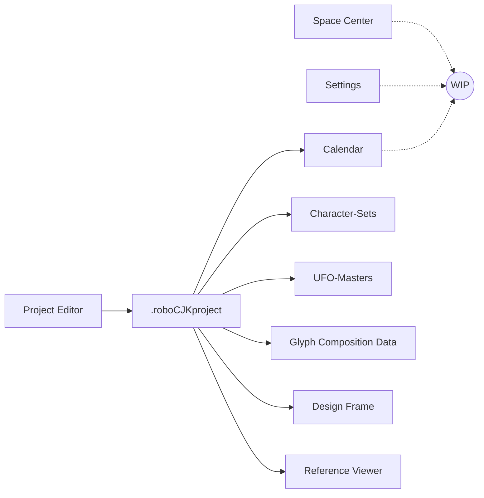
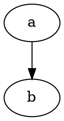

```mermaid
graph LR
PE[Project Editor] --> .roboCJKproject
SC[Space Center] -.-> wip((WIP))
Settings -.-> wip((WIP))

 .roboCJKproject --> Calendar
 .roboCJKproject --> Character-Sets
 .roboCJKproject --> UFO-Masters
 .roboCJKproject --> gcd[Glyph Composition Data]
 .roboCJKproject --> df[Design Frame]
 .roboCJKproject --> rf[Reference Viewer]


Calendar -.->  wip((WIP))

```

```dot
digraph G{ 
a -> b
} 
```
<!--stackedit_data:
eyJoaXN0b3J5IjpbLTY0MzQ1ODA2MSw2OTg5NTcxNzAsNDgyNT
AwNjE2LC0xMzc5NzA5MjhdfQ==
-->