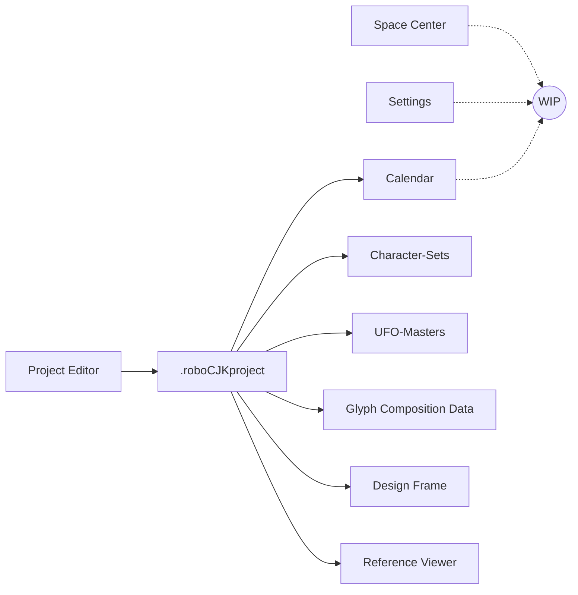

```mermaid
graph LR
PE[Project Editor] --> .roboCJKproject
SC[Space Center] -.-> wip((WIP))
Settings -.-> wip((WIP))

 .roboCJKproject --> Calendar
 .roboCJKproject --> Character-Sets
 .roboCJKproject --> UFO-Masters
 .roboCJKproject --> gcd[Glyph Composition Data]
 .roboCJKproject --> df[Design Frame]
 .roboCJKproject --> rf[Reference Viewer]


Calendar -.->  wip((WIP))

```

<!--stackedit_data:
eyJoaXN0b3J5IjpbLTU3ODQzOTM5MiwtNjQzNDU4MDYxLDY5OD
k1NzE3MCw0ODI1MDA2MTYsLTEzNzk3MDkyOF19
-->